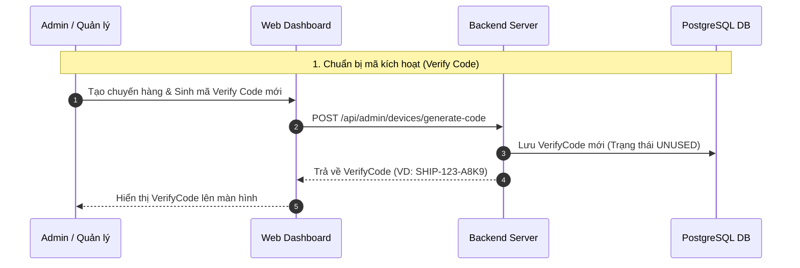
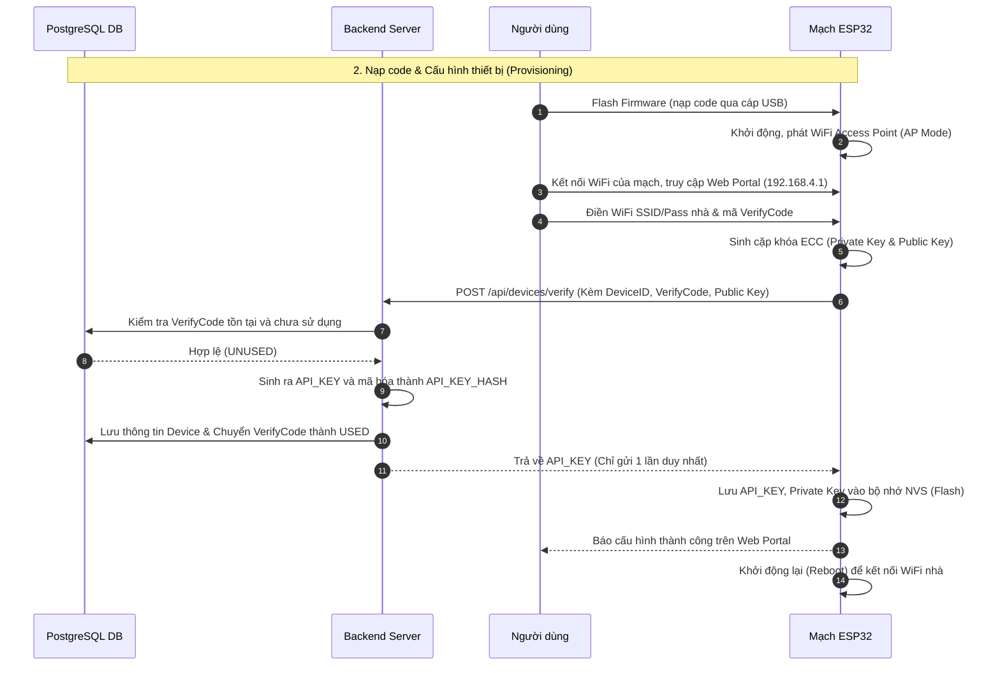
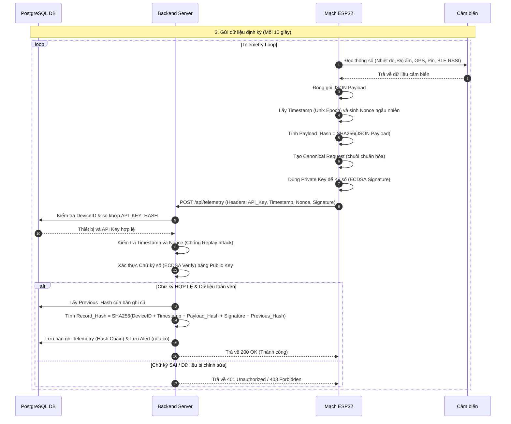

# Sơ đồ luồng dữ liệu (Data Flow & Sequence Diagram)

Sơ đồ dưới đây mô tả toàn bộ vòng đời của một thiết bị IoT trong hệ thống Cold Chain. Để dễ theo dõi, sơ đồ được chia làm 3 giai đoạn riêng biệt.

## Giai đoạn 1: Chuẩn bị mã kích hoạt
Quản trị viên sinh mã Verify Code trên Web Dashboard để chuẩn bị cấp cho một thiết bị IoT mới.

## Giai đoạn 2: Nạp code & Cấu hình thiết bị (Provisioning)
Người dùng nạp code cho mạch ESP32. Sau đó kết nối vào mạng WiFi do ESP32 phát ra để cài đặt WiFi nhà và nhập mã Verify Code.

## Giai đoạn 3: Hoạt động (Telemetry Loop)
Thiết bị đọc cảm biến định kỳ, mã hóa dữ liệu, ký chữ ký điện tử và gửi lên Backend. Backend xác thực và lưu vào chuỗi Hash Chain.

